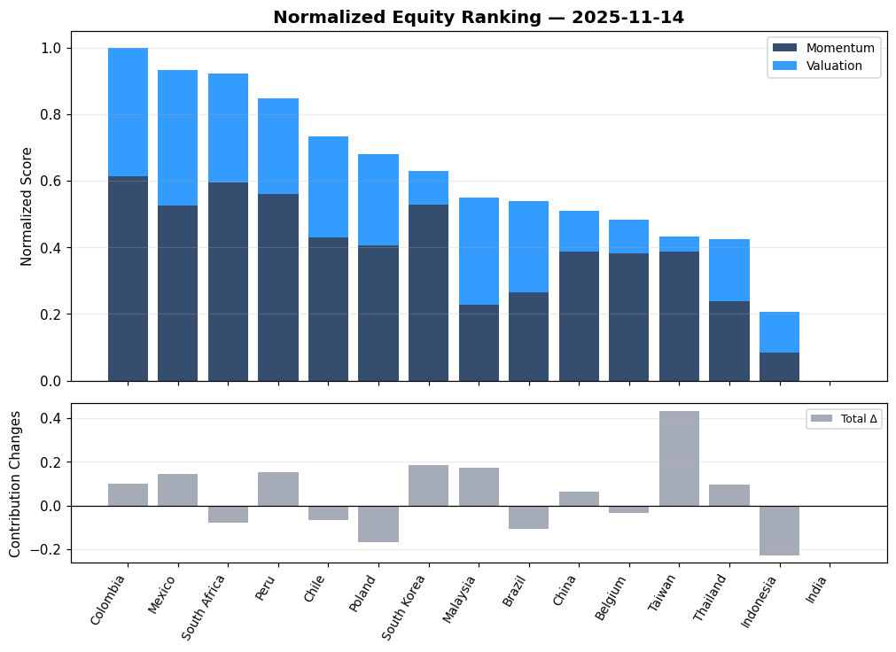
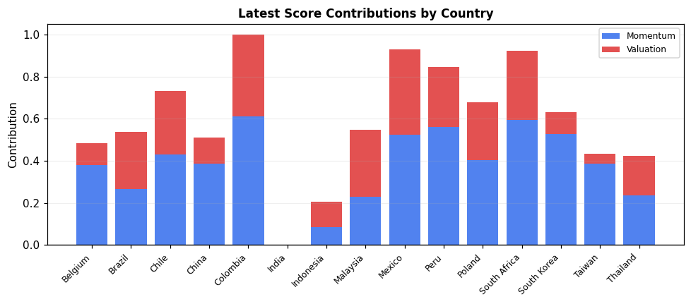
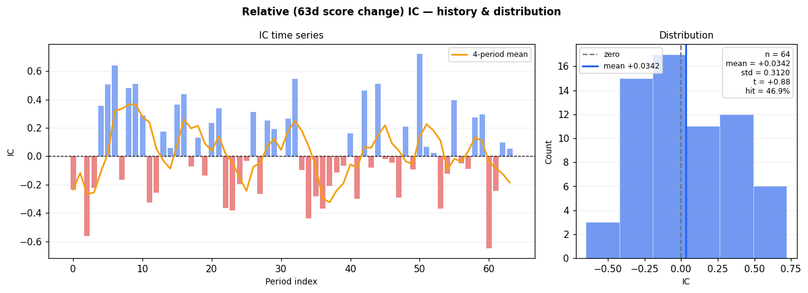
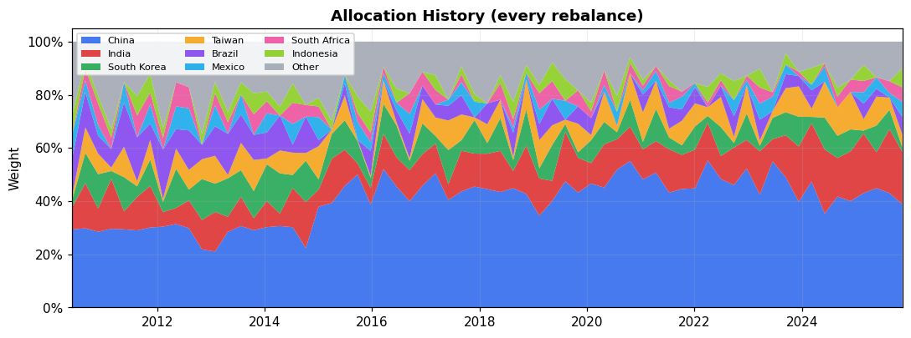
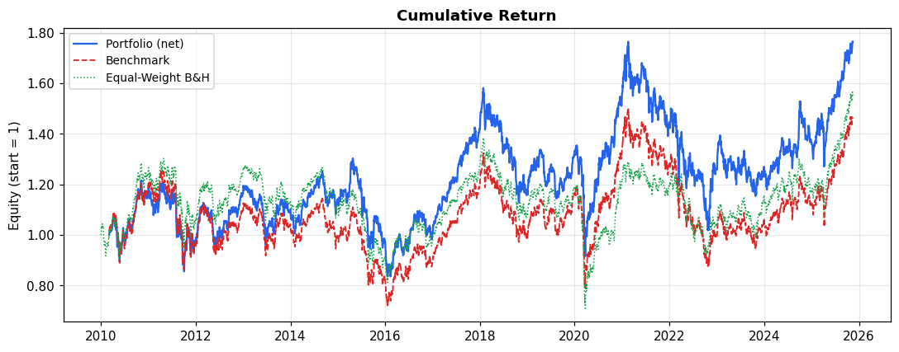
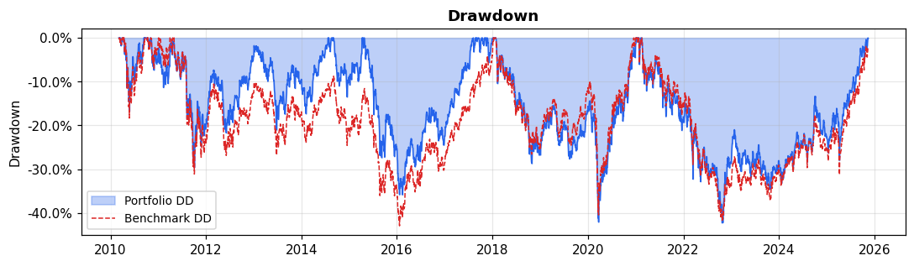
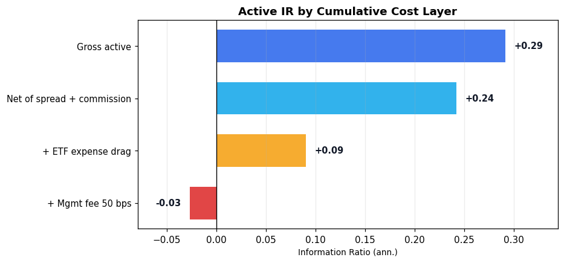
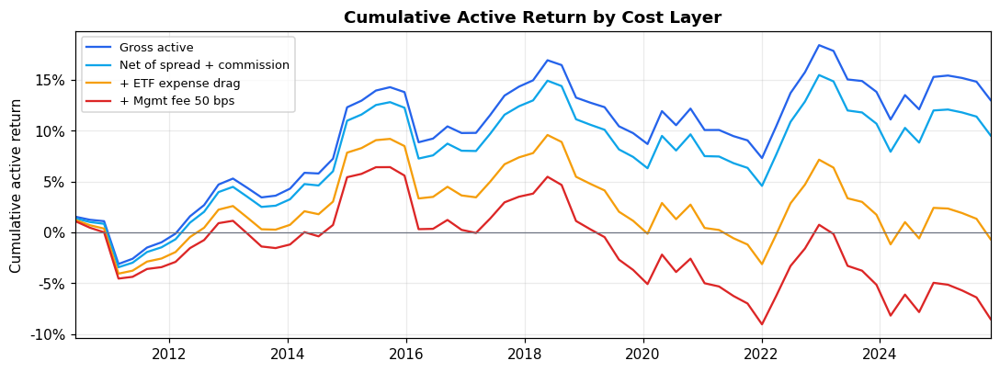
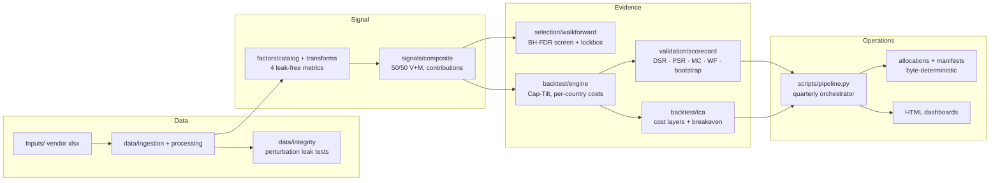

<div align="center">

# Country Rotation Strategies

**A factor-based country equity rotation research platform with pre-registered statistical validation**

[](https://github.com/alanvaa06/country_rotation_strategies/actions/workflows/ci.yml)
[](pyproject.toml)
[](LICENSE)
[](tests/)

*Alan Vazquez, CFA — June 2026*

</div>

---

This repository implements, validates and operates factor-based country rotation strategies on 34 developed and emerging equity markets (daily data, 2010–2025). Its distinguishing commitment is **evidentiary honesty**: every strategy faces pre-registered certification gates (deflated Sharpe, Monte-Carlo nulls, walk-forward, bootstrap), every transform is leak-tested by automated perturbation checks, every artifact is byte-deterministic, and negative results are reported with the same prominence as positive ones.

**The full evidence cycle is documented in an academic-style paper:** [*Factor-Based Country Rotation Under Honest Validation*](docs/research/paper_country_rotation_2026.md).

| Deployed book (configs/production.json) | Benchmark | IR | MC skill p | Evidence grade |
|---|---|---|---|---|
| **EM Cap-Tilt** (50/50 Value+Momentum @63d) | EM cap index | **+0.29** | **0.030** | Power-limited candidate — paper-trade |
| **DM Cap-Tilt** (same signal) | ACWI-equivalent | +0.30 | 0.040 | **Composition bet** — alpha is the passive DM−ACWI spread, not selection |

Neither book clears the full certification bar; the binding failures are *statistical power* (an IR of 0.3 needs ~45–87 years to clear DSR ≥ 0.95; the sample has 16), not overfitting — a distinction the platform proves rather than asserts ([forensics](scripts/overfit_forensics.py)).

---

## The investment process

Everything below regenerates from one command (`python scripts/pipeline.py quarterly`); the figures are exported verbatim from the platform's dashboards (`python scripts/export_readme_figures.py`).

### 1 · Theory before data

The factor set was frozen from a 23-source, adversarially-verified literature review **before any backtest ran** ([literature notes](docs/research/country_rotation_literature.md)):

| Prior | Source | Claim carried |
|---|---|---|
| Country momentum 12-1 | Asness–Moskowitz–Pedersen (2013) | 8.7%/yr, t = 4.14 — strongest country factor |
| Country value (E/P, P/B, P/E) | AMP (2013) | 6.0%/yr, t = 3.45; corr with momentum ≈ −0.35 |
| 50/50 Value+Momentum blend | AMP (2013); Asness–Ilmanen–Maloney (2017) | Blend Sharpe 1.16 > either leg |
| Breadth over strength | Calice–Lin (2021) | Per-factor IC ≈ 0.05 — composites are mandatory |
| Multiple-testing discipline | Harvey–Liu–Zhu (2016); Bailey–López de Prado (2014) | t > 3 discovery bar; deflated Sharpe vs trial ledger |

What the literature did *not* support was excluded by design: raw levels as factors, absolute valuation timing (CAPE thresholds failed out-of-sample), long-run reversion post-1989.

### 2 · Data discipline

34 vendor metric workbooks (prices, valuation, profitability, balance-sheet, estimates), 34 countries, daily 2010–2025. Three rules are enforced *mechanically*:

- **No look-ahead** — gap-fill is forward-only; an automated perturbation harness mutates all data after a cutoff and fails the build if any output at or before the cutoff changes by one bit ([data/integrity.py](country_rotation/data/integrity.py)).
- **No raw levels as factors** — only ratios, yields, spreads and changes enter the catalog (levels are not cross-country comparable).
- **Verified benchmarks** — the vendor "World" index was regression-verified as ACWI-equivalent (0.887 DM + 0.111 EM, residual TE 0.14%/yr) before being used as a measuring stick.

### 3 · Signal construction

Each factor → four leak-free standardized metrics (expanding z-score, expanding percentile, cross-sectional rank, 63-day delta percentile) → factor score → category aggregate → **50/50 Momentum/Valuation composite**, cross-sectionally normalized per date. Category contributions are rebased to sum exactly to the final score, so every ranking decomposes visually:



*Latest EM composite ranking (top panel: score = stacked category contributions; bottom: 63-day score change — the traded signal). The platform trades signal **change**, not level: a pre-registered 6-spec tournament showed level-selection flat-to-negative and its own screen winner losing money traded — see [paper §5.3](docs/research/paper_country_rotation_2026.md).*



### 4 · Does the signal predict? Information coefficient

Per-period Spearman IC between the traded signal and forward 63-day returns, with its full distribution — not a cherry-picked average:



*Mean IC +0.034 on 64 quarterly observations (t = 0.88) — individually weak, exactly the breadth regime the literature predicts (IC ≈ 0.05). Skill is therefore tested at the **book** level against Monte-Carlo random-selection nulls (EM p = 0.030), never inferred from IC alone. Single factors fare worse: **0 of 45 survive** a Benjamini–Hochberg FDR screen at q = 0.10.*

### 5 · Portfolio construction — Cap-Tilt

Equal-weighting a top-5 selection embeds a structural anti-cap bet (cap beat equal-weight by ~3.8%/yr in DM over the span) that destroyed demonstrably-real selection skill in early books. The deployed construction starts from **cap weights** and spends a 30% active-share budget on top-5 overweights / bottom-5 underweights from the same signal — long-only, fully invested, TE capped at 2–4%:



*EM book through time: the cap base (China/India dominance) is inherited from the benchmark; the strategy's decisions are the tilts around it. The DM book mirrors this with a ~65% US base ([figure](docs/figures/dm_allocation_history.png)).*

### 6 · Backtest

Quarterly rebalance (monthly was pre-registered, tested, and **rejected** — it degrades every statistic), per-country one-way trading costs inside the engine, evaluated against the cap benchmark and an equal-weight null:





*EM Cap-Tilt vs EM cap index: IR +0.29, TE 4.3%, beta 1.01. The DM book vs ACWI ([figure](docs/figures/dm_captilt_cumulative_return.png)) shows IR +0.30 — but an exact return decomposition attributes **all of it** to the passive DM−ACWI composition spread (+0.75%/yr, NW t 2.39) with the selection overlay at −0.10%/yr. Benchmark choice and attribution are load-bearing; the platform computes both every run.*

### 7 · Validation gates (pre-registered, all must pass)

| Gate | Threshold | EM book | DM book |
|---|---|---|---|
| Monte-Carlo selection null p | ≤ 0.05 | **0.030 ✓** | **0.040 ✓** |
| Walk-forward efficiency (OOS/IS) | ≥ 0.50 | 2.85 ✓ | 2.40 ✓ |
| OOS folds positive | ≥ 50% | 80% ✓ | 100% ✓ |
| Parameter-sweep stability | ≥ 70% positive | 100% ✓ | 100% ✓ |
| Lo (2002) Sharpe t | ≥ 2.0 | 1.18 | 1.22 |
| PSR / DSR (Bailey–López de Prado) | ≥ 0.95 | 0.88 / 0.76 | 0.89 / 0.84 |
| Bootstrap IR CI low | > 0 | −0.008 | −0.003 |

Formulas with hand-verified unit tests (1e-12 tolerance): [docs/references/validation_formulas.md](docs/references/validation_formulas.md). The DSR is deflated against a ~200-trial multiple-testing ledger. Dedicated forensics ([overfit_forensics.py](scripts/overfit_forensics.py)) separate *power failures* from *overfitting signatures* — both deployed books show the former, not the latter.

### 8 · Transaction costs and fees

Every country trades at its own one-way cost (DM 5–10 bps, EM 12–25 bps + commission); holding-layer drags stack on top:





*Trading costs are survivable (breakeven 102 bps vs ~22 bps modeled, EM; 67 vs ~8, [DM](docs/figures/dm_tca_cost_layers.png)). **Fee layers are the binding constraint**: both books are negative net of a 50 bps management fee — any live mandate needs a sub-30 bps wrapper. This conclusion ships in the pitch material rather than being discovered by due diligence.*

---

## Findings & deliverables

- **[Research paper](docs/research/paper_country_rotation_2026.md)** — the full evidence cycle, methodology, results (including the honest negatives: 0/45 factor screen, tournament winner failing out-of-sample, monthly cadence rejection, benchmark-flip of the EM verdict), forensics and references.
- **[EM pitch script](docs/pitch/EM_captilt_pitch_script.md)** — evidence-first pitch: MC-significant selection skill, power-limited alpha, fee-wrapper constraint, pre-registered kill switch.
- **[DM pitch script](docs/pitch/DM_vsACWI_pitch_script.md)** — built around the alpha decomposition: a composition bet implemented honestly, with the selection overlay in live evaluation.
- **[Final evidence dossier](docs/research/final_evidence_dossier.md)** · **[Segment verdicts](docs/research/segment_verdicts_2026-06-09.md)** · **[Quarterly runbook](docs/research/RUNBOOK_quarterly_recert.md)**.

---

## Architecture



### Package layout

```
country_rotation/
├── config.py            # Frozen dataclass platform config
├── data/                # Ingestion, derived metrics, leakage guards (perturbation tests)
├── factors/             # Catalog (ratios/yields/changes only), 4 standardized transforms, redundancy clustering
├── signals/             # Composite construction with exact contribution decomposition
├── selection/           # OOS-honest screening: per-period IC t-stats, BH-FDR, HLZ labels, lockbox
├── backtest/            # Engine (parity-locked), metrics, IC, benchmarks, TCA (cost layers, breakeven)
├── validation/          # Lo/PSR/DSR/Newey-West/bootstrap, walk-forward, MC nulls, scorecard gates
└── reporting/           # HTML report, research & production dashboards, signal visualizations
```

---

## Production pipeline — one command

The deployed-strategy registry [`configs/production.json`](configs/production.json) drives everything. The quarterly cycle, after refreshing `Inputs/`:

```bash
python scripts/pipeline.py quarterly            # recert -> production -> dashboards
python scripts/pipeline.py quarterly --dry-run  # validate registry + data, print exact plan
```

Stages are independently re-runnable (`recert` / `production` / `dashboards`). Allocations land in `outputs/production/run_{data_end}/{strategy_id}/allocations_latest.json` with the next rebalance date; every run carries the git commit and data-end stamp, and artifacts are **byte-deterministic** given the same inputs (verified by SHA-256 across consecutive full runs). Decision protocol and kill-switch monitors: [runbook](docs/research/RUNBOOK_quarterly_recert.md).

### Scripts

| Script | Purpose |
|--------|---------|
| `pipeline.py` | **Quarterly orchestrator** — recert → production → dashboards, registry-driven |
| `production_run.py` | Per-strategy artifacts: allocations, signals, metrics, IC series, TCA |
| `build_production_dashboard.py` | Self-contained production dashboard over the latest run |
| `research_run.py` | Per-segment research pipeline: screen/prior → composite → validation → report |
| `build_dashboard.py` | Research dashboard (segment tabs × construction toggle) |
| `overfit_forensics.py` | Overfitting signatures, power decomposition, alpha attribution |
| `spec_tournament.py` | Pre-registered signal tournament (screen IC + BH-FDR + one-shot lockbox) |
| `export_readme_figures.py` | Decode curated dashboard figures into `docs/figures/` |
| `build_scores.py` / `run_backtest.py` / `build_report.py` | Single-stage building blocks |

---

## Quick start

```bash
pip install -r requirements.txt
python -m pytest                                   # 233 tests, no market data required
python scripts/research_run.py --segment DM --track prior --quick   # synthetic-scale smoke
```

Full runs require `Inputs/` vendor data (see below):

```bash
python scripts/research_run.py --segment EM --track prior --prior-set vm \
    --construction cap_tilt --bmk-source index --costs configs/costs.json
python scripts/pipeline.py quarterly
```

### Data note

`Inputs/` and `Classification.xlsx` are **gitignored** proprietary vendor data (Bloomberg/FactSet-class workbooks) and are not part of the repository. Supply files matching the schema in [`data/ingestion.py`](country_rotation/data/ingestion.py); the test suite and `--quick` paths run entirely on synthetic fixtures.

### Testing

**233 tests**: unit tests for every module; **parity locks** against the validated legacy implementation; **leakage guards** (deliberate look-ahead injection must fail); statistics verified against hand computations at 1e-12; end-to-end CLI smokes on synthetic Excel fixtures; byte-determinism checks. Legacy root scripts (`backtest.py`, `FactorTransformer.py`, …) are retained solely as the parity-test behavioral reference — do not extend them.

---

## Project documentation map

| Location | Contents |
|----------|----------|
| [`docs/research/`](docs/research/) | Paper, evidence dossier, segment verdicts, literature review, quarterly runbook |
| [`docs/pitch/`](docs/pitch/) | EM and DM strategy pitch scripts |
| [`docs/references/`](docs/references/) | Validation formula derivations, Python practices |
| [`docs/figures/`](docs/figures/) | README figures (exported from the dashboards) |
| [`docs/context/`](docs/context/) | Session log, decision memory, lessons learned |

## License

[MIT](LICENSE) — © 2026 Alan Vazquez.
